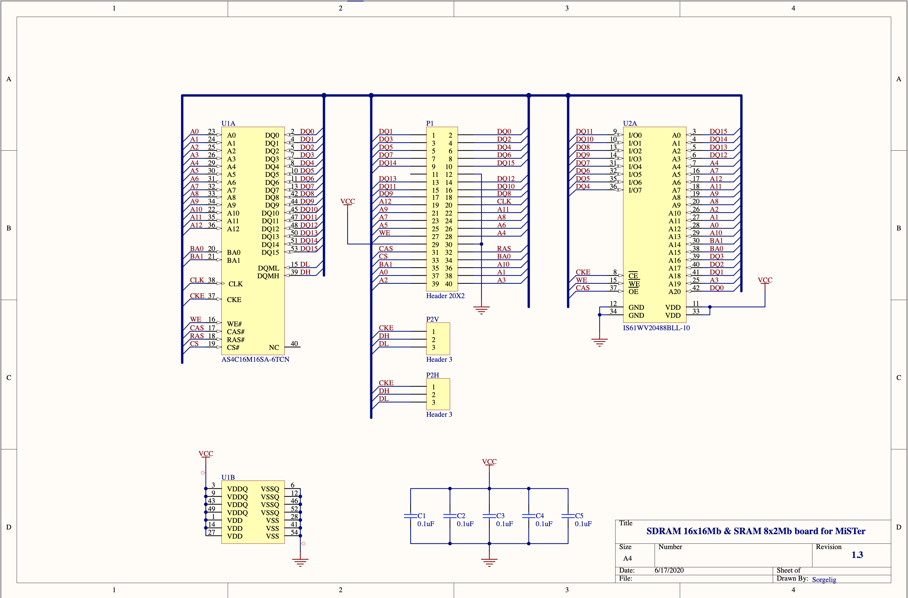
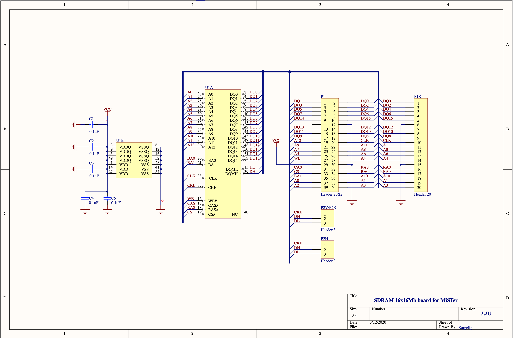
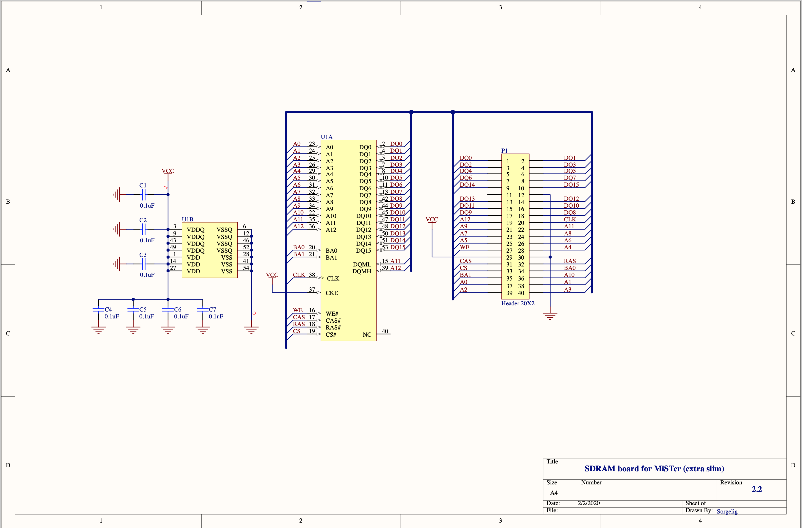
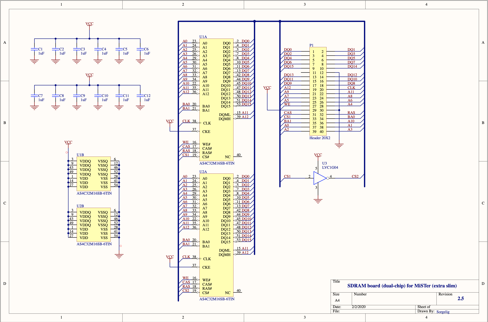
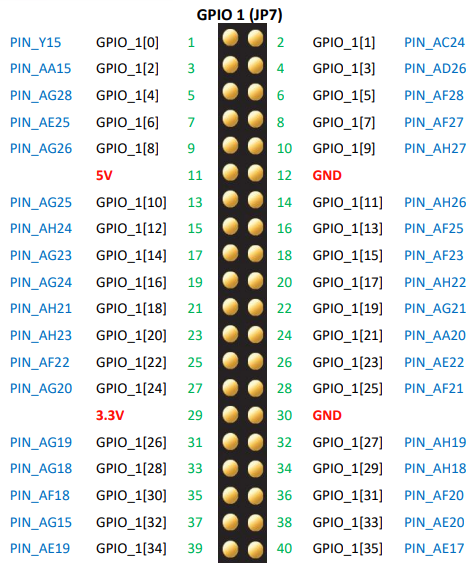
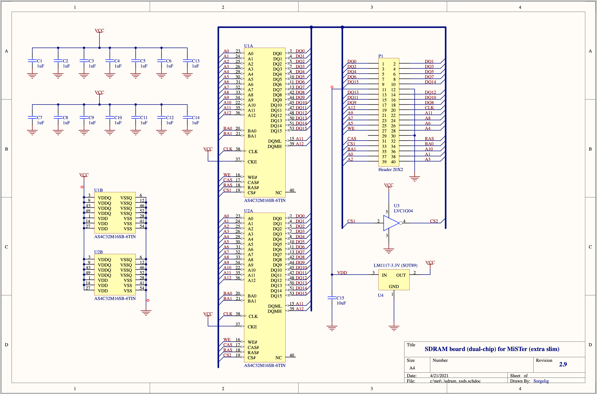

# DECA Retro Cape

## Different Mister SDRAM Versions

Mister Addons are all designed with Altium. If you don't have a license, you can use
the Altium on-line viewer to check out schematics and PCB. I've made a screenshot of some
of them.

There are 2 main variants of SDRAM models:

1. With dedicated DQML/DQMH/CKE pins
1. With DQML/DQMH connected to A11/A12 and CKE strapped to 1.

    A11 and A12 are only used during RAS cycles, not during CAS cycles. Conversely, 
    DQML and DQMH are only during CAS cycles. So you can multi-purpose 2 pins, and thus
    save 2 pins on the connector.

    By strapping CKE to high, you can't use certain low power modes of the SDRAM, but
    that's not a major issue for a Mister-like design.

Because the second variant requires 3 pins less on a connector, it's now the most used option.

* [SDRAM SRAM v1.3](https://github.com/MiSTer-devel/Hardware_MiSTer/tree/master/Addons/SDRAM_SRAM)

    * 1x 16x16Mb SDRAM and 1x SRAM 8x2Mb SRAM.
    * Uses CKE to select between SDRAM and SRAM: CKE is connected SRAM.nCE.
    * Variant 1 connector.
    * Not used very often.

    

* [SDRAM uni 3.2U](https://github.com/MiSTer-devel/Hardware_MiSTer/tree/master/Addons/SDRAM_uni)

    * 1x 16x16Mb SDRAM
    * Variant 1 connector.

    

* [SDRAM xs 2.2](https://github.com/MiSTer-devel/Hardware_MiSTer/tree/master/Addons/SDRAM_xs)

    * Extra Slim (more compact than uni)
    * 1x 16x16Mb SDRAM
    * Variant 2 connector.

    

* [SDRAM xsd 2.5](https://github.com/MiSTer-devel/Hardware_MiSTer/tree/master/Addons/SDRAM_xsd)

    * Extra Slim, Dual-chip
    * 2x 16x16Mb SDRAM
    * All pins are shared between the 2 devices (so no double BW).
    * Variant 2 connector.
    * nCS for SDRAM2 is inverted version nCS of SDRAM1.

        This works because SDRAMs has 2 NOP commands: when nCS is high, all commands to the
        SDRAM are NOP, and when nCS is low, there's still 1 combination that's also a NOP.

    

* [SDRAM xsds 2.9](https://github.com/MiSTer-devel/Hardware_MiSTer/tree/master/Addons/SDRAM_xsds)

    * Extra Slim, Dual-chip
    * Logically identical to SDRAM xsd.
    * Uses DE10-Nano GPIO1 pin 11 (5V) in combination with a 3V3 LDO to power the SDRAMs for
      higher noise resistance, instead of using GPIO1 pin 29 (3V3), which was used in all
      previous designs.

      

    

## References

* [Hardware addons for MiSTer - SDR SDRAM daughter board](https://github.com/MiSTer-devel/Hardware_MiSTer#sdr-sdram-daughter-board)

    Discusses different board versions and SDRAM types, clock speeds.

    This repo also contains the Altium designs for the different add-ons. They can be viewed with the
    [Altium Online Schematic and PCB Viewer](https://www.altium.com/viewer/).

* [Addon Board Repo on GitHub](https://github.com/MiSTer-devel/Hardware_MiSTer/tree/master/Addons)

* [SDRAM Board Wiki](https://github.com/MiSTer-devel/Main_MiSTer/wiki/SDRAM-Board)

* [AS4C32M16SB-6TIN datasheet](https://www.mouser.com/datasheet/2/12/512M%20SDRAM_%20B%20die_AS4C32M16SB-7TCN-7TIN-6TIN_Rev%201-1265391.pdf)

    * [AS4C32M16SB-6TIN on Digikey](https://www.digikey.com/en/products/detail/alliance-memory-inc/AS4C32M16SB-6TIN/6716555)
    * [AS4C32M16SB-6TIN on Mouser](https://www.mouser.com/ProductDetail/913-AS4C32M16SB-6TIN)

* [Altium Online Schematic and PCB Viewer](https://www.altium.com/viewer/)

* [Mister dual-SDRAM Reliability discussion](https://misterfpga.org/viewtopic.php?t=1727)
* [SDRAM Termination discussion](https://www.electronicspoint.com/forums/threads/sdram-clock-termination.19018/)
* [SDRAM Termination discussion](https://designhelp.fedevel.com/forum/test/pcb-layout/82-sdr-sdram-layout-recommendations)
* [SDRAM Termination question on Stackexchange](https://electronics.stackexchange.com/questions/38718/termination-resistors-are-they-needed)

* [Waveshare VGA PS/2 Board](https://www.waveshare.com/vga-ps2-board.htm)
